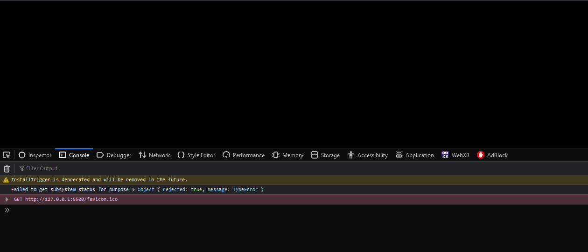
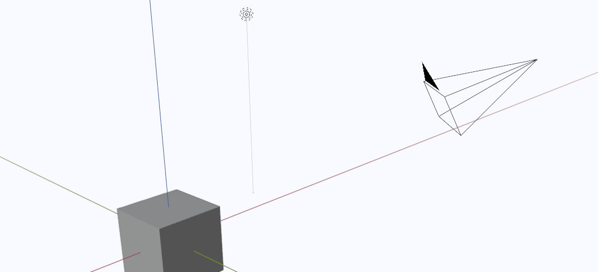
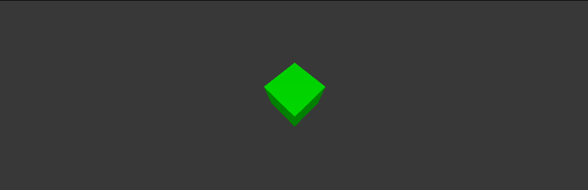

# Create 3D environment

First how do we render a 3D object inside our browser. The answers is WebGl but using raw WebGL is a very convoluted and time consuming process. So we use a library called ThreeJS that does all the hard work for us when it comes to managing the rendering pipeline. [For more on WebGL and computer graphics in general checkout webgl2fundamentals.](https://webgl2fundamentals.org/)


If anything goes wrong in this tutorial check for errors in the console. To open the console press F12 or right click on the page and select inspect. The console is where we will be looking for errors and warnings. Also the console is where we will be printing debug messages and other information.


Before we can render anything we have to define the page. The page can contain anything we want but most importantly it must contain a space where the renderer will draw the scene. In our case that is a **div** with id **"canvas"** that occupies the whole body of the page. The page must also link to a script that will run the logic behind our renderer. Note the script is linked as type **module**.

```html
<!-- index.html -->
<!DOCTYPE html>
<html lang="en">
<head>
    <meta charset="UTF-8">
    <meta http-equiv="X-UA-Compatible" content="IE=edge">
    <meta name="viewport" content="width=device-width, initial-scale=1.0">
    <title>PUT TITLE HERE</title>
    <script src="./app.js" type="module"></script>
</head>
<body>
<div id="canvas">
<!-- space reserved for the renderer -->
</div>
<!-- page can have other html elements some can even be styled to overlap the space delegated to the renderer -->
</body>
</html>
```
The code above will result in a blank static page.
Next we define the renderer component in the scrip and append it to the element we created earlier.

```javascript
// app.js
import {
    Scene,
    PerspectiveCamera,
    WebGLRenderer,
} from '../node_modules/three/build/three.module.js';

//to display the canvas properly remove margins at the window edges
document.body.setAttribute('style', 'margin: 0; overflow: hidden;');
//global variable and object declarations ****************************************************
let scene = new Scene();
let camera = new PerspectiveCamera(75, window.innerWidth / window.innerHeight, 0.1, 1000);
// setup renderer
var renderer = new WebGLRenderer({ antialias: true });
renderer.setPixelRatio(window.devicePixelRatio);
renderer.setSize(window.innerWidth, window.innerHeight);
document.getElementById("canvas").appendChild(renderer.domElement);
```
Right now we defined the renderer, scene and the camera but nothing is being drawn jet. For that we need to tell the render to draw us a frame.
We usually do this by implementing a rendering loop, or preform draw calls when we detect a change.
In this case we will ise a rendering loop that will continually update the canvas.

```javascript
//app.js
renderer.setAnimationLoop(()=>{
    renderScene();
});

function renderScene(){
    renderer.clear();
    renderer.render(scene, camera);
}
```


Alright the renderer is rendering the scene witch is currently empty, so we see only emptiness.
For something interesting to be hapening we have to populate the scene with lights and objects.
We will start with a simple scene that contains a single cube and a light source.
We will also define the camera position and orientation so that the cube is in frame when rendering the scene.



```javascript
//app.js
//add the following imports
import {
    Color,
    AmbientLight,
    BoxGeometry,
    MeshLambertMaterial,
    PointLight,
    Mesh,
} from '../node_modules/three/build/three.module.js';

function sceneInit() {
    //setup lighting
    scene.background = new Color(0x383838);
    const light = new PointLight(0xffffff, 1, 100);
    light.position.set(5, 10, 5);
    scene.add(light);
    const ambientLight = new AmbientLight(0xffffee, 0.2);
    scene.add(ambientLight);

    //create a box
    const geometry = new BoxGeometry(0.5, 0.5, 0.5); //note that the cube is centered at the origin
    const material = new MeshLambertMaterial({ color: 0x00ff00 });
    const cube1 = new Mesh(geometry, material);
    cube = cube1;
    scene.add(cube); //add the cube to the scene

    //define camera position and orientation
    camera.position.z = 0.5;
    camera.position.y = 1.5;
    camera.position.x = 0.5;
    camera.lookAt(0, 0, 0); //look at the origin where the cube is
}

//calling the above function
sceneInit(); //setup lighting and objects
```


Now we should have a scene with a single cube but to make it more interesting we will animate the cube by changing its rotation every frame. We will do this by adding the following code to the render loop.

```javascript
cube.rotation.x += 0.01;
cube.rotation.y += 0.01;
```
The final result should look something like this:


```javascript
import {
    Scene,
    PerspectiveCamera,
    WebGLRenderer,
    Vector3,
    Color,
    AmbientLight,
    BoxGeometry,
    MeshLambertMaterial,
    PointLight,
    Mesh,
} from '../node_modules/three/build/three.module.js';

//to display the canvas properly remove margins at the window edges
document.body.setAttribute('style', 'margin: 0; overflow: hidden;');

//global varible and object declarations ****************************************************
let scene = new Scene();
let camera = new PerspectiveCamera(75, window.innerWidth / window.innerHeight, 0.1, 1000);

let cube;

// setup renderer
var renderer = new WebGLRenderer({ antialias: true });
renderer.setPixelRatio(window.devicePixelRatio);
renderer.setSize(window.innerWidth, window.innerHeight);
renderer.xr.enabled = true;
renderer.autoClear = false;
document.getElementById("canvas").appendChild(renderer.domElement);

function sceneInit() {
    scene.background = new Color(0x383838);
    const light = new PointLight(0xffffff, 1, 100);
    light.position.set(5, 10, 5);
    scene.add(light);
    const ambientLight2 = new AmbientLight(0xffffee, 0.2);
    scene.add(ambientLight2);

    //create a box
    const geometry = new BoxGeometry(0.5, 0.5, 0.5);
    const material = new MeshLambertMaterial({ color: 0x00ff00 });
    const cube1 = new Mesh(geometry, material);
    cube = cube1;
    scene.add(cube);

    camera.position.z = 0.5;
    camera.position.y = 1.5;
    camera.position.x = 0.5;
    camera.lookAt(0, 0, 0);
}

sceneInit(); //setup lighting and helper objects

//setup program loop
renderer.setAnimationLoop(()=>{
    renderScene();
});

function renderScene(){
    cube.rotation.x += 0.01;
    cube.rotation.y += 0.01;
    renderer.clear();
    renderer.render(scene, camera);
}

window.addEventListener('resize', onWindowResize);
function onWindowResize() {
    camera.aspect = window.innerWidth / window.innerHeight;
    camera.updateProjectionMatrix();
    renderer.setSize(window.innerWidth, window.innerHeight);
}
```

As for the final touch I added a resize event listener that will update the camera aspect ratio and the renderer size when the window is resized.

## Conclusion
In this tutorial we learned how to setup a basic three.js project and how to render a scene with a single cube.
We also learned how to animate the cube by changing its rotation every frame.

## Next tutorial
As we can see the code is starting to get a bit messy so in the next tutorial we will learn how to organize the code in a more modular way.
We already hade a taste of organizing the code by encapsulating code in functions like **SceneInit()** or **RenderScene()** 
but we will go a step further and create a class for the scene.
This will allow us to have a better overview of the code and to reuse the code in other projects.
