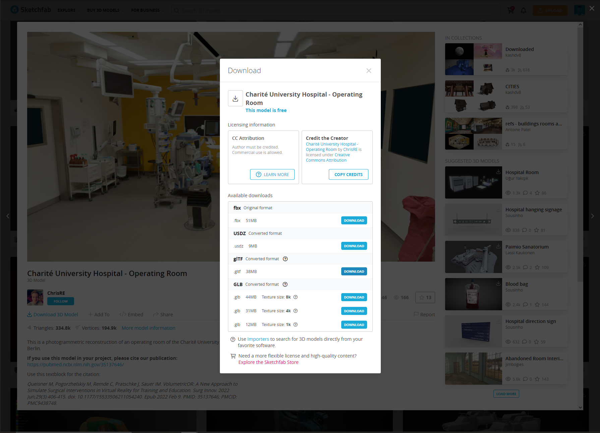

# importing GLFT models

In the previous tutorial we learned how to setup a basic three.js project and how to create a scene with a single cube. Now we will be adding a model to the scene. We will be using the gltf format for the model. The gltf format is a binary format for 3D models that is supported by most 3D software. The model we will be using is 3D scan of a operating room. The model can be downloaded from [here](https://sketchfab.com/3d-models/charite-university-hospital-operating-room-9ec46c4d615a4581a235eebfb162f574). We will also be importing a custom model made in Blender.

## downloading the model from sketchfab
First we find the model we want to download. In this case we will be using the operating room model. We can download the model by clicking on the download button.
after clicking on the download button we will be presented with a list of formats that the model can be downloaded in. We will be using the gltf format.

In the future the library will support more formats but for now we will be using the gltf format.

